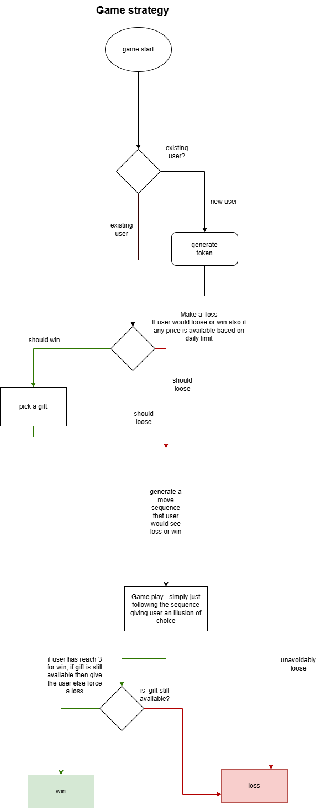

## Submission Summary

# Xtremepush Backend Test – Implementation Summary

## Overview

I implemented the scratch card game as a database-backed Laravel feature with persistent game state, segment-aware prize selection, campaign/prize validity checks, controlled win/loss planning, and API-driven tile reveals.

The goal was to replace the starter demo/cache-based behavior with a real backend-driven game flow that is:

- persistent across refreshes
- segment-aware
- campaign-aware
- prize-aware
- testable
- maintainable

---

## Core Design Decisions

### 1. Database-backed game state
The starter code used cache as a simplified example. I replaced that with persistent database-backed game state so that:

- a user can refresh and continue their unfinished game
- revealed tiles are preserved
- win/loss state is tracked
- prize awarding is auditable

### 2. Session-based player identity
This public game flow does not require user login, so I used a session-backed `player_token` to identify returning players.

This allows the backend to:

- restore unfinished games
- distinguish one visitor from another
- avoid relying on authentication for public gameplay

### 3. Segment is defined by the campaign link
The public campaign link includes a `segment` query parameter, for example:

```text
/test-campaign-1?a=account&segment=low
````

I treated that as the source of truth for the game’s segment.

That means:

* a game is created for the segment in the link
* the segment is stored on the game
* all prize selection for that game uses the stored segment
* segment is not dynamically changed mid-game
* if a segment has no eligible prizes, a new playable game is not created

### 4. Planned sequence approach

Instead of deciding every tile reveal dynamically at click time, I used a prebuilt reveal sequence stored on the game.

This made the implementation much clearer and safer.

At game creation:

* the system decides whether the game is a winning or losing game
* if it is a winning game, it chooses:

  * a winning prize
  * the flip on which the user will win
* it then builds a reveal plan sequence and stores it

Then on each tile click:

* the next prize is read from the reveal plan
* the tile is stored
* the API returns the matching image
* on the configured winning flip, the user wins
* if max flips is reached without a win, the user loses

This avoids accidental wins and makes gameplay behavior consistent.

---

## Data Model

## Existing tables used

### `campaigns`

Used to determine:

* campaign validity
* campaign timezone
* campaign-to-prize relationship
* campaign-to-game relationship

### `prizes`

Used to determine:

* prize segment
* prize image
* prize weight
* prize-level date validity
* prize eligibility
* winning prize candidates

### `games`

Used to store the overall state of a user’s game.

I extended it to support gameplay planning and persistence.

---

## New / Extended Schema

## `games` table additions

I added fields to support persistent, planned gameplay:

* `player_token`
* `winning_prize_id` nullable
* `winning_flip` nullable
* `max_flips`
* `flips_count`
* `reveal_plan` JSON
* `result`
* `finished_at`

### Meaning of these fields

#### `player_token`

A session-based UUID used to identify the same public player across requests.

#### `winning_prize_id`

The hidden prize the game is intended to award, if the game is a winning game.

If null, the game is a planned losing game.

#### `winning_flip`

The flip number on which the third matching tile should appear for a winning game.

If null, the game is a planned losing game.

#### `max_flips`

Maximum number of meaningful flips for the game.

I used a controlled number of flips because the seeded data only provides a small number of prizes per segment, and allowing too many true prize reveals would make accidental 3-matches mathematically inevitable.

#### `flips_count`

Tracks how many flips have been made so far.

#### `reveal_plan`

A JSON array of prize IDs in reveal order.

Example:

```json
[5, 7, 5, 9, 5]
```

This means:

* flip 1 reveals prize 5
* flip 2 reveals prize 7
* flip 3 reveals prize 5
* flip 4 reveals prize 9
* flip 5 reveals prize 5 → third match, win

#### `result`

Stores final outcome such as:

* `won`
* `lost`

#### `finished_at`

Marks when the game ended.

---

## `game_tiles` table

I added a dedicated `game_tiles` table to persist revealed tile state.

Fields include:

* `game_id`
* `tile_index`
* `prize_id`
* timestamps

### Why a separate table?

I used a relational table instead of storing revealed tiles as JSON because it is:

* easier to query
* easier to validate
* easier to restore
* more maintainable
* more testable

It also allows constraints like:

* one tile index per game can only be revealed once

---

## Services

## `CampaignStateService`

This service is responsible for campaign-level playability checks.

It determines whether a campaign is playable based on:

* campaign start date
* campaign end date
* campaign timezone
* segment validity
* prize availability for the given segment

### Why campaign timezone matters

The `Campaign` model has a `timezone` field, so I treated campaign timing as timezone-aware.

This avoids comparing campaign dates using server time incorrectly.

### Responsibilities

* determine if a campaign has started
* determine if a campaign has ended
* return a user-facing message when the campaign is not playable
* validate the requested segment
* prevent play if no eligible prizes exist for that segment

---

## `PrizeSelectionService`

This service handles prize selection and prize eligibility.

### Responsibilities

* return playable prizes for a given campaign + segment
* return winnable prizes for a given campaign + segment
* apply prize start/end date rules
* apply segment filtering
* select a weighted winning prize
* enforce daily prize availability rules if configured

### Weighted selection

For winner selection, I used the weighted query pattern from the instructions:

```php
->orderByRaw('-LOG(RAND()) / weight')
```

This means higher-weight prizes are more likely to be chosen as winning prizes.

This is used for hidden winner selection, not for every reveal.

### Playable vs winnable prizes

I separated these concepts:

#### Playable prizes

Prizes that can be shown as decoys/reveals.

#### Winnable prizes

Prizes that are allowed to actually be awarded.

This makes the reveal logic more flexible and consistent.

---

## `GameplaySessionService`

This service handles player identity and game creation.

### Responsibilities

* generate or restore `player_token` from session
* find an unfinished game for the player
* create a new game if none exists
* plan the game sequence at creation time

### Session identity

I used a UUID stored in session as `player_token`.

This lets the app restore unfinished games without requiring authentication.

### Game creation logic

When a new game is created:

1. campaign playability is checked
2. existing unfinished game is restored if present
3. playable prizes are loaded for the campaign + segment
4. a win/loss lottery is performed
5. if winning:

   * a weighted winning prize is selected
   * a winning flip is selected
   * a winning reveal plan is built
6. if losing:

   * a losing reveal plan is built
7. the new game is persisted with the plan

### Win/loss planning

I used a planned approach rather than accidental randomness.

#### Winning game

A winning game has:

* `winning_prize_id`
* `winning_flip`
* a reveal plan that ensures the third matching reveal happens exactly on that flip

#### Losing game

A losing game has:

* `winning_prize_id = null`
* `winning_flip = null`
* a reveal plan that avoids any prize reaching 3 matches

---

## `GamePlayService`

This service handles tile flips.

### Responsibilities

* validate that the game can still be played
* validate tile index
* reject duplicate tile reveals
* read the next prize from the reveal plan
* persist the revealed tile
* increment flip count
* determine win/loss
* return API payload

### How flip works

On each request:

1. load the game
2. ensure it is not already finished
3. ensure the tile index is valid
4. ensure the tile has not already been revealed
5. determine the next reveal from `reveal_plan`
6. create a `game_tiles` record
7. increment `flips_count`
8. if this is the configured winning flip for the winning prize:

   * mark game as won
   * assign `prize_id`
   * return win message
9. else if max flips is reached:

   * mark game as lost
   * return loss message
10. otherwise:

* return only the tile image

### Benefit of sequence-driven gameplay

This made the flip logic much simpler, because the difficult game balancing decisions happen once during game creation.

---

## Controllers

## Frontend controller

The frontend controller is responsible for bootstrapping the game config passed to the page.

### Responsibilities

* locate the campaign from the route
* read `a` and `segment` from the query string
* resolve the player token
* restore or create the player’s game
* return the JSON config expected by the frontend

The config includes:

* `apiPath`
* `gameId`
* `revealedTiles`
* optional `message`

### Revealed tiles on refresh

Revealed tiles are loaded from the database and returned to the frontend so that the board can be rehydrated correctly after refresh.

---

## Flip API controller

The flip controller is intentionally thin.

### Responsibilities

* validate request input
* load the correct game
* call `GamePlayService`
* return the JSON response

This keeps business logic out of the controller and inside services.

---

## Request validation

I used request validation for the flip endpoint.

### Validated inputs

* `gameId`
* `tileIndex`

### Additional runtime validation

In the gameplay service, I also enforce:

* tile must be in range
* tile must not already be revealed
* game must not already be finished
* game must still have flips remaining

---

## Prize and Campaign Validity Rules

A prize is eligible only when all relevant conditions are met.

### Campaign-level checks

* campaign has started
* campaign has not ended

### Prize-level checks

* prize belongs to the campaign
* prize matches the game segment
* prize is within its own valid date window
* prize is playable/winnable under current rules

This means I do not assume prize dates are always identical to campaign dates, even if the seed data currently aligns them.

---

## Why I used a planned reveal sequence

The seeded data provides only a small number of prizes per segment.

That creates a game-balance issue: if too many true prize reveals are allowed from a small prize pool, a 3-match becomes mathematically inevitable.

To avoid that, I used:

* a controlled maximum number of flips
* a prebuilt reveal sequence
* planned winning/loss states

This keeps the game meaningful and predictable from a backend perspective while still looking random to the player.

It also aligns well with the instruction:

> Consider how to create the illusion of equal chance for prizes until the final match.

The reveal plan lets the game feel fair without relying on unsafe per-click randomness.

---

## Test Strategy

I implemented both unit-level service tests and feature-level HTTP tests.

---

## Unit tests

These focus on direct class behavior and game rules.

### `GameplayServiceTest`

Covers:

* valid tile flips reveal the next planned prize
* duplicate tile flip does not increase tile count and returns the same image
* finished game cannot be flipped again
* winning game wins on the configured winning flip
* losing game ends in loss at max flips
* exhausted prize cannot be won again

---

## Feature tests

These verify application behavior through Laravel routes/controllers.

### Campaign frontend tests

Covers:

* campaign page loads with valid link
* active game is restored on revisit
* config includes `revealedTiles`
* invalid campaign state returns message
* no playable prizes returns message

### Flip API tests

Covers:

* valid tile flip returns `tileImage`
* winning flip returns `tileImage` + `message`
* losing final flip returns `tileImage` + `message`
* invalid payload is rejected
* finished game cannot be flipped again

---

## Example test cases covered

### Game creation

* creates a new game for a player with valid campaign + segment
* restores unfinished game for same player token + same segment
* creates separate games for different segments

### Winning plan generation

* reveal plan contains exactly 3 occurrences of the winning prize
* third occurrence happens exactly at `winning_flip`

### Losing plan generation

* no prize appears 3 times in the losing reveal plan

### Gameplay persistence

* revealed tiles survive page refresh
* previously revealed tile cannot be re-clicked

### Outcome logic

* win only occurs on the correct winning flip
* loss occurs when max flips is reached without a win

---

## Security / Integrity considerations

I added backend validations to make the game safer and more robust:

* session-based player identity
* database persistence rather than cache
* tile uniqueness per game
* segment-locked gameplay
* finished games cannot continue
* invalid indices rejected
* game state restored from persisted data
* prize awarding handled only by backend logic

### Player Token Security

* The `player_token` is generated using `Str::uuid()`, making it a cryptographically secure, unguessable UUID.
* The token is required as part of API requests (e.g., in api.php routes) to identify the user on each call.
* This approach ensures that only the user with the correct token can access or continue their game, and no other person can guess or hijack the session.
* The token is never predictable and is not guessable by others, providing strong security for public, unauthenticated gameplay.

---

## Maintainability decisions

I intentionally kept controllers thin and moved logic into services because this test is evaluating Laravel code quality and maintainability.

This results in:

* smaller controllers
* more testable business logic
* cleaner separation of concerns
* better extensibility if rules change later

---

## Summary of what was implemented

* campaign validity checks
* segment-aware gameplay
* session-based public player tracking
* restore unfinished game logic
* persistent revealed tile storage
* weighted winning prize selection
* planned winning/loss reveal sequences
* API-driven tile reveal responses
* revealed tile restoration after refresh
* clean service-based backend architecture
* unit and feature tests covering game flow

---

## Additional Implementation Notes

* Fixed some frontend code to ensure correct integration and user experience.
* Improved and aligned factory logic (for models and test data) to follow better Laravel practices and ensure reliable test coverage.

---

## Final Notes

The seeded data provides a small prize pool per segment, so I intentionally used a planned-sequence approach rather than allowing uncontrolled per-click randomness. This keeps the game logic safe, testable, and aligned with the intended player experience.

The implementation is designed to be clear, maintainable, and easy to extend if prize rules, probability rules, or campaign behavior change later.

## System Diagram


